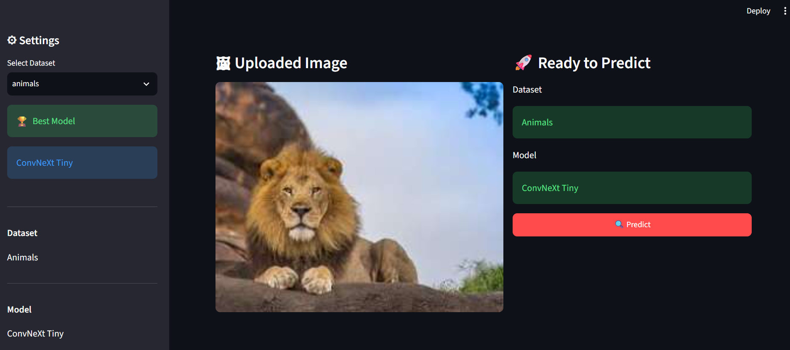
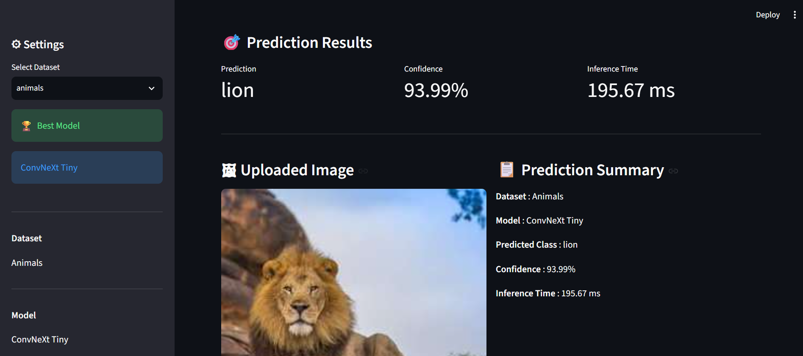
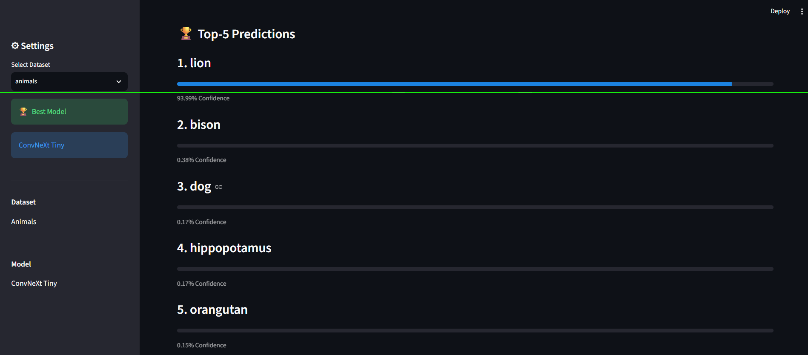

# 🧠 ClassifyAI

<p align="center">


</p>

<p align="center">

## AI-Powered Image Classification using Transfer Learning

A Deep Learning based Image Classification System developed as part of the **GUVI HCL AI/ML Capstone Project**.

</p>

---

# 📖 Overview

ClassifyAI is an end-to-end Deep Learning application that classifies images using state-of-the-art Convolutional Neural Networks (CNNs).

The project performs a comprehensive comparison of seven pretrained deep learning architectures across three different image classification datasets. Based on the experimental evaluation, the best-performing model is automatically selected for deployment through an interactive Streamlit web application.

The project demonstrates the complete Machine Learning workflow:

- Dataset Preparation
- Transfer Learning
- Model Training
- Model Evaluation
- Model Comparison
- Best Model Selection
- Streamlit Deployment

---

# ✨ Features

- ✅ Image Classification using Transfer Learning
- ✅ Interactive Streamlit Web Application
- ✅ Automatic Best Model Selection
- ✅ Top-5 Predictions
- ✅ Confidence Score
- ✅ Inference Time
- ✅ Multi-Dataset Support
- ✅ Comparative Model Evaluation
- ✅ Professional User Interface

---

# 📂 Supported Datasets

| Dataset | Classes |
|----------|---------:|
| Animals | 90 |
| Butterflies | 75 |
| ImageNet10 | 10 |

---

# 🧠 Deep Learning Models Evaluated

The following pretrained CNN architectures were evaluated:

- AlexNet
- VGG16
- VGG19
- ResNet18
- ResNet34
- SEResNet50
- ConvNeXt Tiny

---

# 🏆 Best Performing Model

After evaluating all models across all datasets, **ConvNeXt Tiny** achieved the best overall performance.

| Dataset | Deployment Model |
|----------|-----------------|
| Animals | ConvNeXt Tiny |
| Butterflies | ConvNeXt Tiny |
| ImageNet10 | ConvNeXt Tiny |

The deployed Streamlit application automatically loads the best-performing model for the selected dataset.

---

# 📊 Evaluation Metrics

The trained models were evaluated using:

- Accuracy
- Precision
- Recall
- Macro F1 Score
- Expected Calibration Error (ECE)
- Model Parameters
- MACs (Computational Complexity)
- Inference Time

---

# 🔄 Project Workflow

```text
Dataset Preparation
        │
        ▼
Data Preprocessing
        │
        ▼
Transfer Learning
        │
        ▼
Model Training
        │
        ▼
Validation
        │
        ▼
Testing
        │
        ▼
Performance Evaluation
        │
        ▼
Model Comparison
        │
        ▼
Best Model Selection
        │
        ▼
Streamlit Deployment
```

---

# 🏗️ Project Structure

```text
ClassifyAI/

│── app.py
│── README.md
│── requirements.txt
│── .gitignore

<<<<<<< HEAD
├── checkpoints/
│
├── models/
│
├── src/
│   ├── inference.py
│   └── model_factory.py
│
├── reports/
│
├── Notebook1.ipynb
├── Notebook2.ipynb
└── Notebook3.ipynb
=======
---

## 🛠️ Technologies Used

- Python
- PyTorch
- Torchvision
- TIMM
- Streamlit
- NumPy
- Pandas
- Matplotlib
- Scikit-learn
- Google Colab
- VS Code

---

## ⚙️ Installation

Clone the repository:

```bash
git clone https://github.com/yash-006/ClassifyAI.git
cd ClassifyAI
>>>>>>> e3f4b3f3325eccae58620657da826228a712dd25
```

---

# 🖥️ Streamlit Application

The web application allows users to:

- Select a Dataset
- Upload an Image
- Automatically load the best-performing model
- Predict the image class
- View Confidence Score
- View Inference Time
- View Top-5 Predictions

---

# 📥 Installation

## 1️⃣ Clone Repository

```bash
git clone https://github.com/yash-006/ClassifyAI.git

cd ClassifyAI-Demo
```

---

## 2️⃣ Create Virtual Environment

### Windows

```bash
python -m venv venv

venv\Scripts\activate
```

### Linux / Mac

```bash
python3 -m venv venv

source venv/bin/activate
```

---

## 3️⃣ Install Dependencies

```bash
pip install -r requirements.txt
```

---

## 4️⃣ Download Model Checkpoints

The trained model checkpoints are **not included** in this repository because GitHub restricts large files.

Download the checkpoints from Google Drive:

## 📥 Download Checkpoints

**https://drive.google.com/drive/folders/1h-H1jM_UYUBnzrz1kqjpD6HbF3ZXBVZK?usp=sharing**

After downloading, place them inside:

```text
checkpoints/

├── animals/
│   └── convnext_best.pth

├── butterflies/
│   └── convnext_best.pth

└── imagenet10/
    └── convnext_best.pth
```

---

## 5️⃣ Run the Application

```bash
streamlit run app.py
```

The application will automatically open in your browser.

---

# 📸 Screenshots

## Home Page

> 

---

## Upload Image

> 

---

## Prediction Result

> 

---

## Top-5 Predictions

> 

---

# 📈 Results

ConvNeXt Tiny achieved the best overall balance between:

- High Accuracy
- High Macro F1 Score
- Low Expected Calibration Error
- Fast Inference
- Computational Efficiency

Therefore, ConvNeXt Tiny was selected as the deployment model for the final application.

---

# 🛠️ Technologies Used

### Programming

- Python

### Deep Learning

- PyTorch
- Torchvision
- TIMM

### Data Science

- NumPy
- Pandas
- Matplotlib
- Scikit-learn

### Deployment

- Streamlit

### Development Environment

- Google Colab
- VS Code

---

# 🚀 Future Improvements

- Deploy on Cloud
- Batch Image Prediction
- Grad-CAM Visualization
- Mobile Responsive Interface
- ONNX Export
- Model Quantization
- Docker Deployment

---

# 👨‍💻 Author

## Yash

B.Tech Computer Science Engineering

AI/ML Enthusiast

---

# 🙏 Acknowledgements

<<<<<<< HEAD
This project was developed as part of the **GUVI HCL AI/ML Capstone Project**.

Special thanks to:

- GUVI
- HCL
- PyTorch Community
- Streamlit Team

---

# 📜 License

This project is intended for **educational and learning purposes**.

© 2026 Yash. All Rights Reserved.
=======
This project is developed for educational and learning purposes as part of the GUVI HCL AI/ML Capstone Project.
>>>>>>> e3f4b3f3325eccae58620657da826228a712dd25
